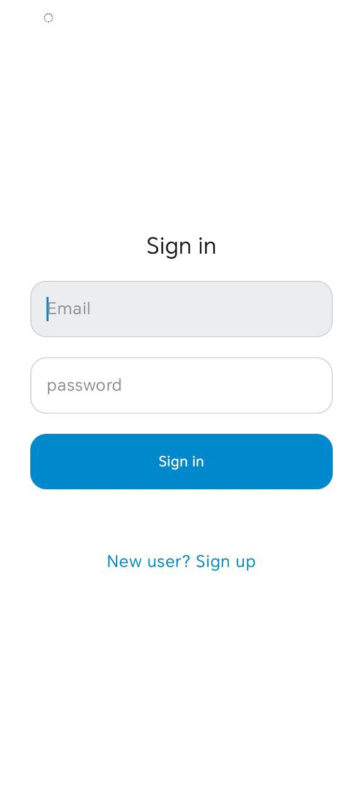
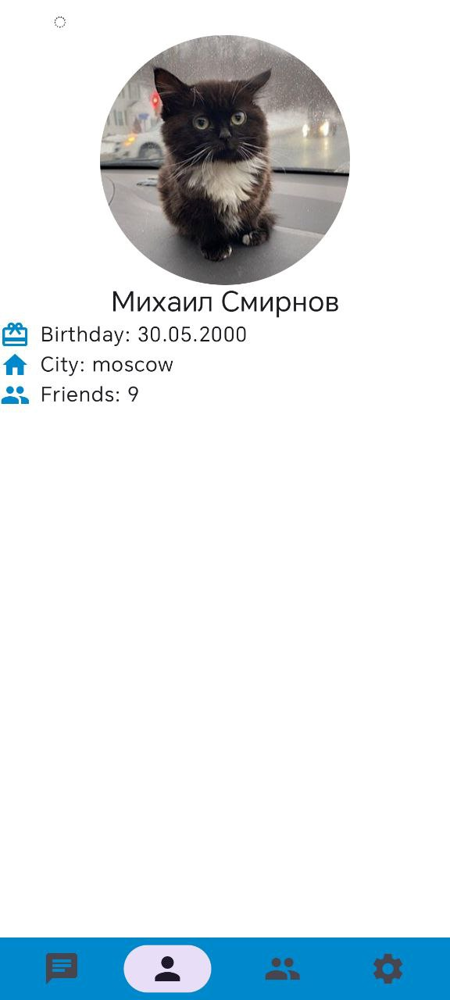
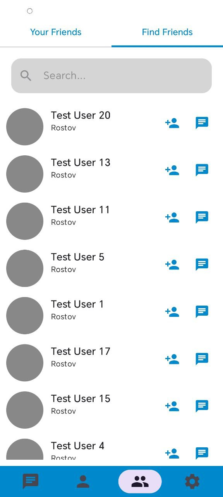
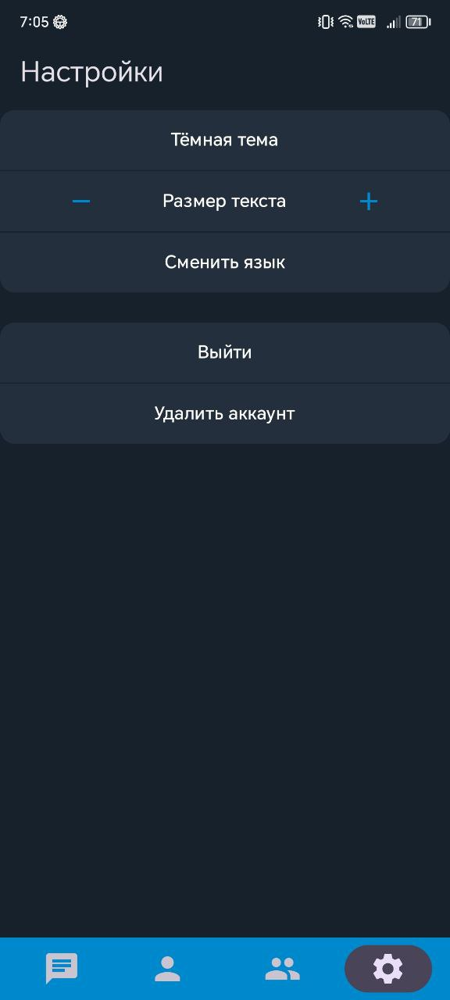

### 🚀 Основные возможности
- **Чат в реальном времени**: Обмен сообщениями через Firebase Firestore.
- **Оффлайн-режим**: Поддержка полной работы без интернета благодаря кэшированию в Room.
- **Система друзей**: Поиск пользователей, пагинация, добавление и удаление из контактов.
- **Групповые чаты**: Создание бесед с неограниченным количеством участников.
- **Обмен медиа**: Отправка фото со сжатием для экономии трафика.

### 🛠 Гибкие настройки
- **Динамическая смена темы**: Переключение между темной и светлой темой.
- **Мгновенная локализация**: Смена языка (RU/EN) на лету без перезагрузки Activity.
- **Масштабируемость**: Изменение масштаба текста во всем приложении.

---
💡 *Для тестирования приложения можно использовать уже готовый аккаунт (данные будут введены автоматически при первом входе).*

<table style="width: 100%;">
  <tr>
    <!-- Задаем ширину заголовков (100% / 7 ≈ 14.2%) -->
    <th width="14.2%">Логин</th>
    <th width="14.2%">Чаты</th>
    <th width="14.2%">Чат</th>
    <th width="14.2%">Профиль</th>
    <th width="14.2%">Друзья</th>
    <th width="14.2%">Настройки</th>
    <th width="14.2%">Темная тема</th>
  </tr>
  <tr>
    <td align="center"></td>
    <td align="center"></td>
    <td align="center"></td>
    <td align="center"></td>
    <td align="center"></td>
    <td align="center"></td>
    <td align="center"></td>
  </tr>
</table>
