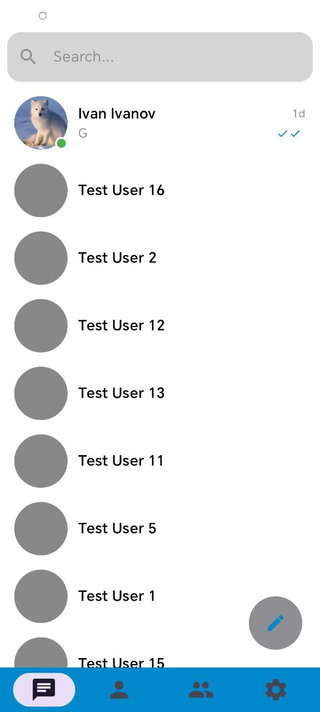
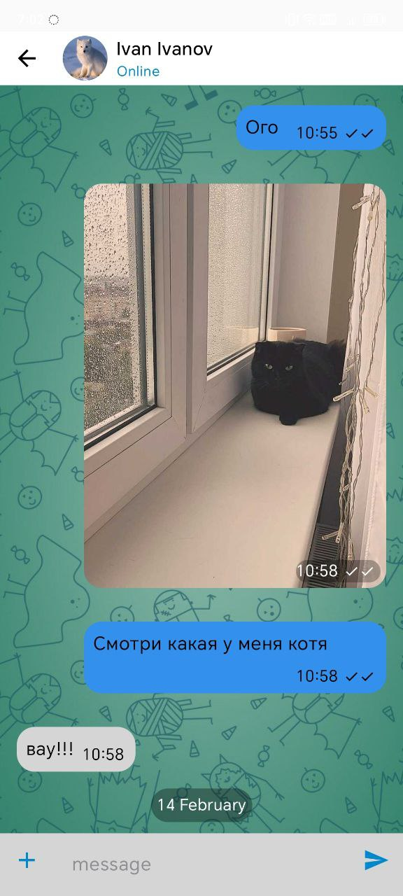
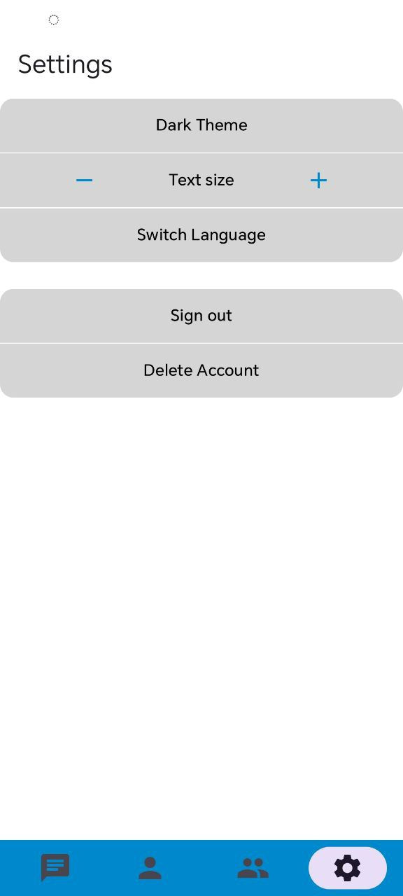

Для тестирования приложения можно использовать уже готовый аккаунт (его данные будут введены при первом входе)

Основные возможности:
-Чат в реальном времени: Обмен сообщениями через Firebase Firestore.
-Оффлайн-режим: Поддержка полной работы без интернета благодаря кэшированию в Room.
-Система друзей: Поиск пользователей, пагинация, добавление и удаление из контактов.
-Групповые чаты: Создание бесед с неограниченным количеством участников.
-Обмен медиа: Отправка фото со сжатием для экономии трафика.

Гибкие настройки:
-Динамическая смена темы (темная/светлая).
-Мгновенная локализация (RU/EN) без перезагрузки Activity.
-Изменение масштаба текста во всем приложении.

| Список чатов | Окно чата | Настройки |
| :---: | :---: | :---: |
|  |  |  |
